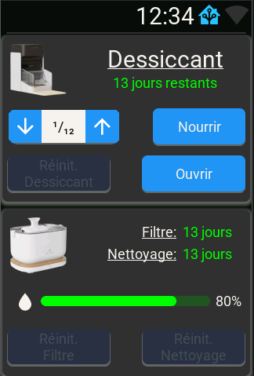

# ESPHome LVGL HMI for Petlibro Feeder and Fountain

This project is an on-device touchscreen interface (HMI) built with ESPHome and LVGL to monitor and control Petlibro devices through Home Assistant. It focuses on two models:

- PLAF301 Feeder
- PLWF105 Fountain

Data and controls come from Home Assistant via the Petlibro custom integration by jjjonesjr33:
- GitHub: https://github.com/jjjonesjr33/petlibro

The UI runs both on an ESP32-S3 device (hardware target) and on a desktop SDL simulator for fast iteration. UI strings are now centralized and localized via simple YAML includes (French provided), so adding a new language is drop-in.



## Features
- Feeder page (PLAF301)
  - Battery, dispenser, food level, lid, and plan status
  - Last/next feed times (Strings supplied by Home Assistant Text sensor)
  - Manual feed quantity display and popup roller control
  - Wi‑Fi status icon and SSID text gated by connection state
  - Device serial number (SN) and MAC address

- Fountain page (PLWF105)
  - Today/yesterday water consumption (mL) and drink counts
  - Water dispensing mode selection (dropdown) synced with HA `select`
  - Water level bar with dynamic coloring based on configurable thresholds
  - Wi‑Fi status icon and SSID text gated by connection state
  - Device serial number (SN) and MAC address

- Notifications & overlays
  - Top-layer notification area with HA/API status and Wi‑Fi indicator
  - Water alert button appears when low-water binary sensor is active; opens warnings overlay
  - Generic confirmation and feeder manual-quantity popups

## How It Works
- ESPHome provides the runtime on the ESP32 and hosts LVGL for rendering the UI.
- Home Assistant entities (from the Petlibro integration) are mirrored in ESPHome using `homeassistant:` sensors/text_sensors/binary_sensors.
- UI widgets update live when HA states change. Pretty time strings are supplied by HA template/text sensors.
- Configuration is centralized in substitutions, including entity IDs, icons, thresholds, and language strings.

## Requirements
- Home Assistant with the Petlibro custom integration installed and configured
- Entities for your feeder and fountain exposed in HA (names can be customized; this project adapts via substitutions)
- ESPHome 2024.11+ recommended

## Repo Layout
- hmi-chat.yaml: Hardware build (ESP32-S3)
- hmi-chat-sdl.yaml: Desktop SDL simulator build
- common.yaml: Common includes and settings
- hmi-chat/display/lvgl: LVGL pages and widgets (feeder, fountain, top-layer)
- hmi-chat/components: ESPHome HA sensors/text_sensors/binary_sensors wiring
- hmi-chat/i18n: Language string files (e.g., French `fr.yaml`)

## Quick Start
1) Configure substitutions:
  - Edit [hmi-chat/substitutions.yaml](hmi-chat/substitutions.yaml) to set your Home Assistant instance URL/token, icons, and entity IDs.
  - Thresholds for fountain water bar coloring are defined as substitutions (percent values):
    - `threshold_water_low_percent` (default 25)
    - `threshold_water_warn_offset_percent` (default 15)

2) Optional: Provide compact “pretty” time strings in Home Assistant:
  - Use HA template/text sensors to emit short values like `45 min`, `7 h`, `2 j`.

3) Run the simulator (fast iteration):
```bash
esphome run hmi-chat-sdl.yaml
```

4) Build and flash hardware:
```bash
esphome upload hmi-chat.yaml
```

5) Required Home Assistant automation (Blueprint)
- Import the blueprint: [hmi-chat/home-assistant/blueprints/hmi_chat_button_events.yaml](hmi-chat/home-assistant/blueprints/hmi_chat_button_events.yaml)
- Or use the raw URL in the Blueprints UI:
  - https://raw.githubusercontent.com/bennydiamond/esphome_lvgl_hmi_chat/main/hmi-chat/home-assistant/blueprints/hmi_chat_button_events.yaml
- Configure inputs:
  - HMI device (for `device_id`)
  - Feeder buttons (`open lid`, `manual feed`, `dessiccant replaced`)
  - Feeder manual feed quantity `select`
  - Fountain buttons (`filter reset`, `cleaning reset`)
  The blueprint maps HMI events to the selected entities. Updates will be tracked via the blueprint’s `source_url`.

## Localization (i18n)
- UI strings are centralized in language files under [hmi-chat/i18n](hmi-chat/i18n). French is provided in [hmi-chat/i18n/fr.yaml](hmi-chat/i18n/fr.yaml).
- The language file is merged into substitutions via a single include in [hmi-chat/substitutions.yaml](hmi-chat/substitutions.yaml):

```yaml
<<: !include i18n/fr.yaml
```

- To add another language (e.g., English):
  - Create [hmi-chat/i18n/en.yaml](hmi-chat/i18n/en.yaml) with the same keys translated.
  - Switch the include in substitutions to:

```yaml
<<: !include i18n/en.yaml
```

No other file changes are needed; the UI references `${i18n_*}` keys.

## Helper Entities (Home Assistant)
- Purpose: user-created helpers augment the Petlibro integration with compact strings, thresholds, aggregated issue lists, and alert signals used by the UI.
- Where: helper entity IDs are defined in [hmi-chat/substitutions.yaml](hmi-chat/substitutions.yaml) under “User Helpers”.

**Feeder Helpers**
- `sensor.liste_problemes_mangeoire_de_la_tite_crisse`: aggregated feeder issues; shown in the notifications popup.
- `sensor.mangeoire_de_la_petite_crisse_derniere_distribution`: compact “last feed” time string for the status label.
- `sensor.mangeoire_de_la_petite_crisse_prochaine_distribution`: compact “next feed” time string for the status label.

**Fountain Helpers**
- `input_number.fontaine_chat_configuration_seuil_niveau_bas`: low-water threshold (%) synced to a global; drives the fountain water bar color (low and warn ranges).
- `binary_sensor.fountaine_chats_niveau_d_eau_bas`: low-water alert; shows the water-alert button in the notification area.
- `sensor.liste_problemes_fontaine_chats`: aggregated fountain issues; shown in the notifications popup.

**Global Helpers**
- `sensor.liste_problemes_fontaine_mangeoire_combined`: combined feeder+fountain issue list; used in the overlay/popup.

Notes:
- Create these helpers in Home Assistant (template sensors, binary sensors, and `input_number`). They are independent of the Petlibro integration and can be tailored to your setup and language.
- Optional custom alerts (e.g., a “no drink all morning” binary sensor) can be added similarly and referenced from substitutions.

## Customization Tips
- Fonts, colors, and layout live under [hmi-chat/display](hmi-chat/display).
- If your entity names differ, edit [hmi-chat/substitutions.yaml](hmi-chat/substitutions.yaml) to point to your IDs.
- To change text language or phrasing, update HA-side templates/text sensors and/or provide a new i18n file.

## Credits
- Petlibro Home Assistant integration by jjjonesjr33: https://github.com/jjjonesjr33/petlibro
- ESPHome: https://esphome.io/
- LVGL: https://lvgl.io/
